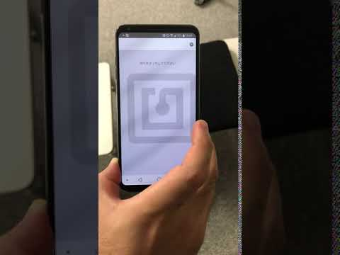

# NFC-Alarm

## 製品概要
### 絶起 x Tech

### 背景（製品開発のきっかけ、課題等）
多くの大学生にとって、絶起（起床に失敗し講義等に遅刻すること）は深刻な事態に繋がりうる未解決問題として知られている。
本プロダクトでは、NFCタグを用いた新たなアラームシステムを開発し、強制的に起床を促すことでこの問題の解決を試みた。

### 製品説明（具体的な製品の説明）
目覚まし時計としての基本的な機能を備えているが、止める手段としてNFCタグを用いたシステムを採用しており、スマートフォンをNFCタグの元へ持って行って認識を行わなければアラームを解除することができない。NFCタグは小さなシール状のものが販売されており、これを寝床から離れた場所に貼り付けることで、そこまでの強制的な移動、ひいては起床を促す。

### 特長

#### 1. 特長1
基本的な目覚まし時計としての機能を一通り備えている。
#### 2. 特長2
確実な起床を促すため、アラームの音量を最大化し、音量も変更できないよう固定する。アプリを終了してもアラームは鳴り続ける。
#### 3. 特長3
アラームを停止する手段としてNFCタグの認識を利用しており、所定の場所までの移動を強制して起床を促すことができる。
またより一般に、起床に限らずアラーム音を利用してNFCタグのある場所への移動を強制することで、特定の時間に特定の場所に移動する手段として用いることができる。

### 解決出来ること
通常の目覚まし時計を使っても、目覚まし時計を停止させてしまい絶起してしまう人についても、強引に起床を促すことできる。

### 今後の展望
今回は基本的に単一のNFCタグのみを用いているが、複数のNFCタグを用いることで、より一般的な行動を促すことができる。
例えば、複数のNFCタグを所定の順序で認識することでしか解除できなくすることで強制力を高める、離れた距離に設置した複数のNFCタグを交互に認識しなければならないように設定することで、運動を促すなど。

## 開発内容・開発技術
主にReact Nativeを用いて目覚まし時計アプリ及びNFCタグの認証機能、それらの統合を実装した。

### 活用した技術
* JavaScript
* React Native
* NFCタグ

#### フレームワーク・ライブラリ・モジュール
* React Native

#### デバイス
* スマートフォン（Android)

### 独自開発技術（Hack Dayで開発したもの）
#### 2日間に開発した独自の機能・技術
全ての機能はHack Day2日間の間に実装した。
